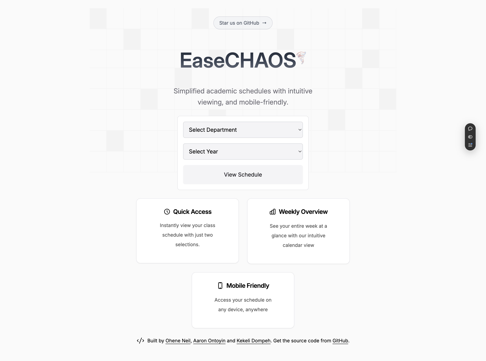

  
  <h1>easeCHAOS</h1>

## About

easeCHAOS is a modern, user-friendly timetable viewer designed specifically for UMaT students. Born out of the frustration of dealing with complex Excel spreadsheets and hard-to-read class schedules, this project aims to make viewing your class schedule as simple as possible.

### Why easeCHAOS?

- **Simplified View**: No more squinting at Excel sheets or searching through merged cells
- **Class-Specific**: View only your class's schedule, filtered and clean
- **Modern Interface**: Intuitive weekly and daily views
- **Mobile Friendly**: Access your schedule on any device
- **Download Options**: Download your schedule in pdf, image, calendar file(ics), and excel format.

## Current Progress

The application currently features:
- ✅ Weekly view with all classes
- ✅ Daily detailed view
- ✅ Class filtering system
- ✅ Responsive design with Light and Dark Theme
- ✅ Calendar download (PDF & Image)

## Getting Started

### Prerequisites
- Node.js 18+
- Python 3.9+
- Redis
- Docker (Optional)

## Tech Stack

### Frontend
- React.js
- TailwindCSS
- TypeScript
- Vite

### Backend
- FastAPI (Python)
- Redis
- Docker

### Installation (Local without Docker)

1. Clone the repository
2. Ensure you have `make` installed
3. Copy and rename `.env.sample` to `.env`
4. Run `make local` to start the application on local. However, before that, note that you would need a `redis` instance. You could create one on [upstash.com](https://upstash.com/) and just place the details in the `.env` file.

### Installation (Docker)

1. Clone the repository
2. Copy and rename `.env.sample` to `.env`
3. Run `make up` to start the application on docker.

NB: This project is still under development.

### Current Progress

#### Light Theme

#### Dark Theme

## Contributors

- [@Aaron Ontonyin](https://github.com/Aaron-Ontoyin)
- [@Kekeli Dompeh](https://github.com/db-keli)
- [@Neil Ohene](https://github.com/0xDVC)
